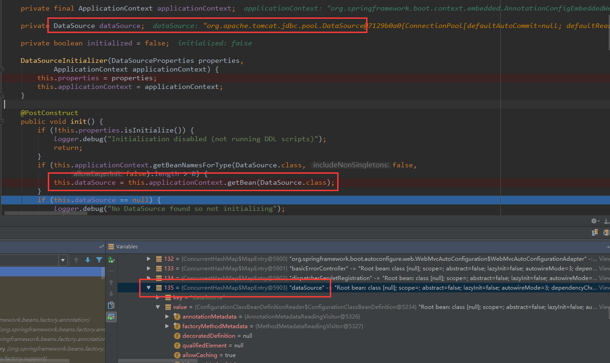

## 1、添加数据源依赖：

既然要使用JdbcTemplate，则需要添加jdbc的依赖。

```xml
<dependency>
    <groupId>org.springframework.boot</groupId>
    <artifactId>spring-boot-starter-jdbc</artifactId>
</dependency>
```


## 2、连接数据源，以mysql为例：

```xml
<dependency>
    <groupId>mysql</groupId>
    <artifactId>mysql-connector-java</artifactId>
</dependency>
```


## 3、在src/main/resources/application.properties中配置数据源信息

注意：其中driver-class可以不写，Spring Boot会自动从url中解析使用的数据源类

Spring Boot默认采用**tomcat-jdbc**连接池，如果需要**C3P0，DBCP，Druid**等作为连接池，需要加入相关依赖以及配置，这里不作说明，采用默认配置即可。

```properties
spring.datasource.driver-class-name=com.mysql.jdbc.Driver
spring.datasource.url=jdbc:mysql://localhost:3306/test
spring.datasource.username=...
spring.datasource.password=...
```


## 4、使用JdbcTemplate操作数据库

> SpringBoot中的 **JdbcTemplate** 是自动配置的，可以直接使用 **@Autowired** 或者 **@Resource** 来注入到需要的类中。

#### **==JdbcTemplateAutoConfiguration==**

```java
@Configuration
@ConditionalOnClass({ DataSource.class, JdbcTemplate.class })
@ConditionalOnSingleCandidate(DataSource.class)
//在DataSourceAutoConfiguration自动配置类完成后再进行自动配置该类JdbcTemplateAutoConfiguration
@AutoConfigureAfter(DataSourceAutoConfiguration.class)
public class JdbcTemplateAutoConfiguration {

	private final DataSource dataSource;

	public JdbcTemplateAutoConfiguration(DataSource dataSource) {
		this.dataSource = dataSource;
	}

    //创建一个JdbcTemplate的Bean
	@Bean
	@Primary
	@ConditionalOnMissingBean(JdbcOperations.class)
	public JdbcTemplate jdbcTemplate() {
		return new JdbcTemplate(this.dataSource);
	}

	@Bean
	@Primary
	@ConditionalOnMissingBean(NamedParameterJdbcOperations.class)
	public NamedParameterJdbcTemplate namedParameterJdbcTemplate() {
		return new NamedParameterJdbcTemplate(this.dataSource);
	}

}

```

​	在**JdbcTemplateAutoConfiguration**类中会创建一个**JdbcTemplate**的Bean，所以在使用的时候可以直接注入。


#### **==DataSourceAutoConfiguration==**

```java
@Configuration
@ConditionalOnClass({ DataSource.class, EmbeddedDatabaseType.class })
//启动DataSourceProperties配置类
@EnableConfigurationProperties(DataSourceProperties.class)
@Import({ Registrar.class, DataSourcePoolMetadataProvidersConfiguration.class })
public class DataSourceAutoConfiguration {

	private static final Log logger = LogFactory
			.getLog(DataSourceAutoConfiguration.class);

	@Bean
	@ConditionalOnMissingBean
	public DataSourceInitializer dataSourceInitializer(DataSourceProperties properties,
			ApplicationContext applicationContext) {
        //根据配置文件属性创建DataSource的初始化器
		return new DataSourceInitializer(properties, applicationContext);
	}
    
    //...
}
```


#### **==DataSourceInitializer==**

```java
class DataSourceInitializer implements ApplicationListener<DataSourceInitializedEvent> {
    private final DataSourceProperties properties;

	private final ApplicationContext applicationContext;

	private DataSource dataSource;

	private boolean initialized = false;

	DataSourceInitializer(DataSourceProperties properties,
			ApplicationContext applicationContext) {
		this.properties = properties;
		this.applicationContext = applicationContext;
	}

	@PostConstruct
	public void init() {
        //当DataSourceProperties初始化完成后
		if (!this.properties.isInitialize()) {
			logger.debug("Initialization disabled (not running DDL scripts)");
			return;
		}
		if (this.applicationContext.getBeanNamesForType(DataSource.class, false,
				false).length > 0) {
            //获取DataSource的bean
			this.dataSource = this.applicationContext.getBean(DataSource.class);
		}
		if (this.dataSource == null) {
			logger.debug("No DataSource found so not initializing");
			return;
		}
		//...
	}
}
```



​	最后使用**JdbcTemplate**操作数据库，就类似在Spring框架中使用**JdbcTemplate**一样，这里就不再累赘了。

------
#### 插入一波广告，欢迎关注
|**#**|**#**|
|:--|:--:|
|**作者:**|**Cay**|
|**QQ:**|<a target="_blank" href="http://wpa.qq.com/msgrd?v=3&uin=412425870&site=qq&menu=yes"></a>|
|**邮箱:**|**412425870@qq.com**|
|**微信公众号：Cay课堂**|****|
|**csdn博客：**|**[http://blog.csdn.net/caychen](http://blog.csdn.net/caychen "我的csdn博客")**|
|**码云：**|**[https://gitee.com/caychen/](https://gitee.com/caychen/ "我的码云")**|
|**github：**|**[https://github.com/caychen](https://gitee.com/caychen/ "我的github")**|
|**点击群号或者扫描二维码即可加入QQ群:[328243383(1群)](https://jq.qq.com/?_wv=1027&k=54r3suD)**|****|
|**点击群号或者扫描二维码即可加入QQ群:[180479701(2群)](https://jq.qq.com/?_wv=1027&k=521g7zY)**|****|
