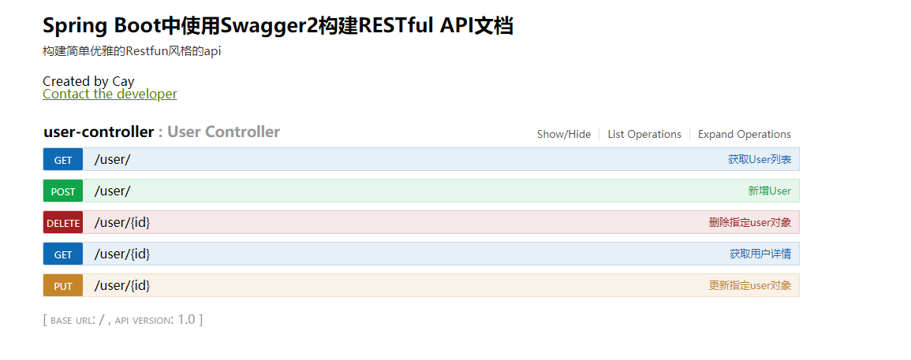

一、Swagger2概念

Swagger 是一款RESTFUL接口的文档在线自动生成+功能测试功能软件。

Swagger 是一个规范和完整的框架，用于生成、描述、调用和可视化 RESTful 风格的 Web 服务。总体目标是使客户端和文件系统作为服务器以同样的速度来更新。文件的方法，参数和模型紧密集成到服务器端的代码，允许API来始终保持同步。Swagger 让部署管理和使用功能强大的API从未如此简单。

官网：http://swagger.io/

GitHub地址：https://github.com/swagger-api/swagger-ui

二、为什么要使用Swagger2？

Swagger2引入的好处，同样也是手写Api文档的几个痛点：

- 文档需要更新的时候，需要再次发送一份给前端，也就是文档更新交流不及时。
- 接口返回结果不明确
- 不能直接在线测试接口，通常需要使用工具，比如postman
- 接口文档太多，不好管理

三、使用Swagger2

3.1、添加Swagger2依赖：

    <dependency>
        <groupId>io.springfox</groupId>
        <artifactId>springfox-swagger2</artifactId>
        <version>2.2.2</version>
    </dependency>
    <dependency>
        <groupId>io.springfox</groupId>
        <artifactId>springfox-swagger-ui</artifactId>
        <version>2.2.2</version>
    </dependency>

3.2、创建Swagger2配置类

- 使用@Configuration来表示该类是个配置类
- 使用@EnableSwagger2来启用Swagger2

    @Configuration
    @EnableSwagger2//启用Swagger2
    public class Swagger2Config {
    
    	//从配置文件中获取属性值
    	@Value("${swagger2.basepackage}")
    	private String basepackage;
    
    
    	/**
    	 * buildDocket()用于创建Docket的Bean，
    	 * buildApiInfo()创建Api的基本信息，用于显示在文档页面上。
    	 * select()函数返回一个ApiSelectorBuilder实例，用来控制哪些接口暴露给Swagger2来展现。
    	 *      一般采用指定扫描的包路径来定义，本例中Swagger会扫描controller包下所有定义的API，并产生文档内容（除了被@ApiIgnore指定的请求）。
    	 *
    	 * @return
    	 */
    	@Bean
    	public Docket buildDocket(){
    		return new Docket(DocumentationType.SWAGGER_2)
    				.apiInfo(buildApiInfo())
    				.select()
    				.apis(RequestHandlerSelectors.basePackage(basepackage))
    				.paths(PathSelectors.any())
    				.build();
    	}
    
    	private ApiInfo buildApiInfo(){
    		return new ApiInfoBuilder()
    				.title("Spring Boot中使用Swagger2构建RESTful API文档")
    				.description("构建简单优雅的Restfun风格的api")
    				.termsOfServiceUrl("https://github.com/caychen")
    				.contact(new Contact("Cay", "", "412425870@qq.com"))
    				.version("1.0")
    				.build();
    	}
    }

3.3、添加文档内容

- @Api：用于controller请求类上，说明该类的说明
      @Api(value = "用户Controller")
      public class UserController {}

- @ApiOperation：用在controller类的具体请求方法上，说明方法的作用和用途
  - value：说明方法的用途、作用
  - notes：备注说明

    @ApiOperation(value = "获取User列表", notes = "获取所有User对象")
    public List<User> getUserList() {}

- @ApiModel：用于响应类上，表示一个返回响应数据的信息(这种一般用在post创建的时候，使用@RequestBody这样的场景，请求参数无法使用@ApiImplicitParam注解进行描述的时候）
  - @ApiModelProperty：用在相应类的属性上，描述响应类的属性
    - value：参数名称
    - required：是否必须boolean
    - hidden：是否隐藏hidden

    @ApiModel(value = "用户对象User")
    public class User implements Serializable {
        @ApiModelProperty(value = "用户id", name = "uid")
        private Integer uid;
        @ApiModelProperty(value = "用户名", name = "uname")
        private String uname;
        @ApiModelProperty(value = "用户年龄", name = "uage")
        private Integer uage;
    }

- @ApiResponses：用于controller类的具体请求方法上，来表示一组响应
  - @ApiResponse：用在@ApiResponses中，一般用于表达一个错误的响应信息
    - code：状态码
    - message：信息
    - response：响应的类型，默认void

- @ApiImplicitParams：用在请求的方法上，表示一组参数说明
  - @ApiImplicitParam：用在@ApiImplicitParams注解中，指定一个请求参数的各个方面
    - name：对应方法中接收参数名，必须指定
    -  value：参数的说明、解释
    - required：参数是否必须传参，必须指定
    - paramType：参数放在哪个地方，必须指定
      - header --> 请求参数从header请求头中获取，需要使用@RequestHeader
      - query --> 请求参数从url的请求中获取，@RequestParam。例如 ?query=q ,jquery ajax中data设置的值也可以，例如 data:{query:”q”}，在Controller中不需要添加注解就可以直接接收。
      - path（用于restful接口）--> 请求参数从path中获取：需要使用@PathVariable
      - body --> 需要使用@RequestBody接收数据，POST有效
      - form --> 表单提交，必须使用post提交
    -  dataType：参数类型，默认String，如果类型名称相同，请指定全路径，例如 dataType = “java.util.Date”，springfox会自动根据类型生成模型
    - defaultValue：参数的默认值
      @PutMapping("/{id}")
      @ApiOperation(value = "更新指定user对象", notes = "根据url的id来指定更新对象，并根据传过来的user信息来更新用户详细信息")
      @ApiImplicitParams({
          @ApiImplicitParam(name = "id", value = "需要更新的用户id", required = true, dataType = "Integer", paramType = "path"),
          @ApiImplicitParam(name = "user", value = "用户详细实体user", required = true, dataType = "User", paramType = "body")
      })
      public String updateUser(@PathVariable Integer id, @RequestBody User user) {}
  
  
- @ApiIgnore：使用该注解忽略Controller的api方法

具体参照UserController：

    @RestController
    @RequestMapping("/user")
    @Api(value = "用户Controller")
    public class UserController {
    
    	private static final Logger logger = LoggerFactory.getLogger(UserController.class);
    
    	@Autowired
    	private IUserService userService;
    
    	//@RequestMapping("/")
    	@GetMapping("/")
    	@ApiOperation(value = "获取User列表", notes = "获取所有User对象")
    	public List<User> getUserList() {
    		logger.info("获取User列表...");
    		return userService.getUserList();
    	}
    
    	@GetMapping("/{id}")
    	@ApiOperation(value = "获取用户详情", notes = "根据url中用户id来获取该用户的详情")
    	@ApiImplicitParam(name = "id", value = "用户id", required = true, dataType = "Integer", paramType = "path")
    	public User getById(@PathVariable Integer id) {
    		logger.info("获取id为{}的User...", id);
    		return userService.getById(id);
    	}
    
    	@PostMapping("/")
    	@ApiOperation(value = "新增User", notes = "根据User对象创建用户")
    	@ApiImplicitParam(name = "user", value = "用户详细实体user", required = true, dataType = "User", paramType = "body")
    	public String addUser(@RequestBody User user) {
    		logger.info("新增User对象...");
    		int result = userService.addUser(user);
    		if (result == 1) {
    			return "success";
    		} else {
    			return "error";
    		}
    	}
    
    	@PutMapping("/{id}")
    	@ApiOperation(value = "更新指定user对象", notes = "根据url的id来指定更新对象，并根据传过来的user信息来更新用户详细信息")
    	@ApiImplicitParams({
    			@ApiImplicitParam(name = "id", value = "需要更新的用户id", required = true, dataType = "Integer", paramType = "path"),
    			@ApiImplicitParam(name = "user", value = "用户详细实体user", required = true, dataType = "User", paramType = "path")
    	})
    	public String updateUser(@PathVariable Integer id, User user) {
    		logger.info("更新id为{}的User对象...", id);
    		user.setUid(id);
    		int result = userService.updateUser(id, user);
    		if (result == 1) {
    			return "success";
    		} else {
    			return "error";
    		}
    	}
    
    	@DeleteMapping("/{id}")
    	@ApiOperation(value = "删除指定user对象", notes = "根据url中的id来删除user对象")
    	@ApiImplicitParam(name = "id", value = "需要删除user对象的id", required = true, dataType = "Integer", paramType = "path")
    	public String deleteUser(@PathVariable Integer id) {
    		logger.info("删除id为{}的User对象...", id);
    		int result = userService.deleteUser(id);
    		if (result == 1) {
    			return "success";
    		} else {
    			return "error";
    		}
    	}
    }

3.4、启动项目，访问http://ip:port/swagger-ui.html

依次点开每个url，即可在线调试。
